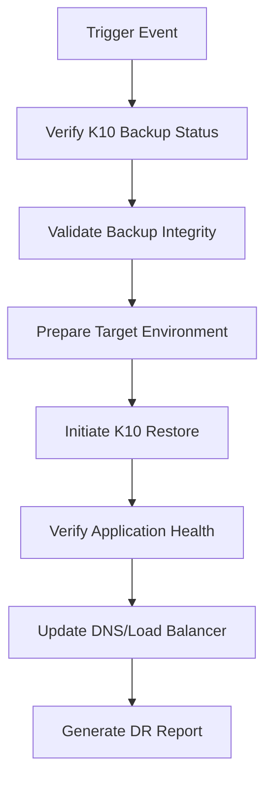

# VRO Fundamentals (Part 10) - Implementing Fully Automated Container Disaster Recovery with VRO and K10


## Series Table of Contents:

- [VRO Fundamentals (Part 1) - Introduction](https://blog.backupnext.cloud/2023/05/VRO-v6-Guide-01/)
- [VRO Fundamentals (Part 2) - Installation and Deployment](https://blog.backupnext.cloud/2023/05/VRO-v6-Guide-02/)
- [VRO Fundamentals (Part 3) - Basic Components · Part 1](https://blog.backupnext.cloud/2023/05/VRO-v6-Guide-03/)
- [VRO Fundamentals (Part 4) - Basic Components · Part 2](https://blog.backupnext.cloud/2023/05/VRO-v6-Guide-04/)
- [VRO Fundamentals (Part 5) - First Steps to Successful Disaster Recovery Planning](https://blog.backupnext.cloud/2023/06/VRO-v6-Guide-05/)
- [VRO Fundamentals (Part 6) - Data Labs](https://blog.backupnext.cloud/2023/06/VRO-v6-Guide-06/)
- [VRO Fundamentals (Part 7) - Plan Steps · Part 1](https://blog.backupnext.cloud/2023/06/VRO-v6-Guide-07/)
- [VRO Fundamentals (Part 8) - Plan Steps · Part 2](https://blog.backupnext.cloud/2023/06/VRO-v6-Guide-08/)
- [VRO Fundamentals (Part 9) - Document Template Analysis](https://blog.backupnext.cloud/2023/10/VRO-v6-Guide-09/)
- [VRO Fundamentals (Part 10) - Implementing Fully Automated Container Disaster Recovery with VRO and K10](https://blog.backupnext.cloud/2023/11/VRO-v6-Guide-10/)

For this final article in the series, I'll walk you through a practical implementation of using VRO to achieve fully automated container disaster recovery with K10, step by step.

## Basic Lab Environment Configuration

**vSphere 7.0**
- Kubernetes cluster running on vSphere VMs
- Kasten K10 installed and configured for container backup
- VRO v6 deployed and integrated with VBR v12

## Introduction to VRO and K10 Integration

As containerized applications become increasingly critical to business operations, the need for robust disaster recovery solutions for Kubernetes environments has never been more important. Veeam Recovery Orchestrator (VRO) v6, combined with Kasten K10, provides a comprehensive solution for automated container disaster recovery that extends Veeam's proven DR capabilities to Kubernetes workloads.

### Why Combine VRO with K10?

K10 excels at Kubernetes-native backup and recovery, providing application-consistent backups, policy-based automation, and multi-cloud mobility. However, when it comes to enterprise-grade disaster recovery orchestration, compliance reporting, and automated testing, VRO brings additional capabilities that are essential for production environments:

- **Automated DR Orchestration**: VRO can orchestrate complex multi-step recovery processes
- **Comprehensive Testing**: Built-in DataLabs for non-disruptive DR testing
- **Compliance Reporting**: Automated documentation generation for audit requirements
- **Integration with Existing Infrastructure**: Seamless integration with vSphere and traditional VM workloads

## Prerequisites for Integration

Before implementing VRO with K10, ensure you have the following components in place:

### 1. Kubernetes Cluster Requirements
```bash
# Verify cluster readiness
kubectl cluster-info
kubectl get nodes
kubectl get storageclass
```

### 2. K10 Installation and Configuration
Ensure K10 is properly installed with these key components:
- K10 dashboard accessible
- Storage profiles configured
- Backup policies in place
- Export location set up

### 3. VRO Infrastructure
- VRO v6 server deployed
- Integration with VBR v12 configured
- Appropriate licensing for container workloads
- Network connectivity between VRO and Kubernetes cluster

## Architecture Overview

The integration architecture follows this pattern:

```
[Kubernetes Cluster] ←→ [K10] ←→ [Object Storage] ←→ [VRO] ←→ [vSphere/VBR]
      ↓                      ↓                ↓               ↓
  Container           K10 Backup        Backup           VRO Orchestration
  Workloads           Operations        Storage          and Automation
```

## Step-by-Step Implementation

### Step 1: Configure K10 Backup Export

First, ensure K10 can export backups to a location accessible by VRO:

```yaml
# Example K10 export profile configuration
apiVersion: config.kio.kasten.io/v1alpha1
kind: ExportProfile
metadata:
  name: vro-storage-profile
  namespace: kasten-io
spec:
  type: ObjectStore
  objectStore:
    type: S3
    name: vro-s3-store
    region: us-east-1
    bucket: k10-backups
    accessKey: <your-access-key>
    secretKey: <your-secret-key>
```

### Step 2: Set Up VRO Integration

Configure VRO to recognize K10 backup locations:

1. **Add Storage Location in VRO**
   - Navigate to Infrastructure → Storage
   - Add new object storage location pointing to K10 export bucket
   - Configure credentials and connection settings

2. **Create Container Resource Group**
   - Create a new resource group for container workloads
   - Map Kubernetes namespaces to VRO resource groups
   - Define recovery objectives (RPO/RTO)

### Step 3: Define Orchestration Plan

Create a comprehensive orchestration plan for container DR:



### Step 4: Configure Automated Testing

Set up regular DR testing using VRO DataLabs:

1. **Create DataLab Environment**
   - Isolated network segment for testing
   - Clone of production storage
   - Automated environment provisioning

2. **Define Test Scenarios**
   - Application functionality tests
   - Data integrity verification
   - Performance benchmarking
   - Security validation

### Step 5: Implement Monitoring and Alerting

Configure comprehensive monitoring:

```yaml
# Example monitoring configuration
apiVersion: v1
kind: ConfigMap
metadata:
  name: vro-monitoring
  namespace: monitoring
data:
  prometheus.yml: |
    scrape_configs:
      - job_name: 'vro-metrics'
        static_configs:
          - targets: ['vro-server:9100']
      - job_name: 'k10-metrics'
        static_configs:
          - targets: ['k10-service:8080']
```

## Advanced Configuration Options

### Multi-Cloud Recovery Scenarios

VRO enables sophisticated multi-cloud recovery strategies:

1. **Cross-Cloud Restore**
   - Restore from on-premises to cloud
   - Cloud-to-cloud disaster recovery
   - Hybrid cloud scenarios

2. **Application Mobility**
   - Migrate applications between regions
   - Blue-green deployment strategies
   - A/B testing environments

### Custom Script Integration

Extend VRO capabilities with custom scripts:

```powershell
# Example PowerShell script for application verification
param(
    [string]$Namespace,
    [string]$AppName
)

# Verify pod status
$pods = kubectl get pods -n $Namespace -l app=$AppName -o json
$runningPods = ($pods.items | Where-Object { $_.status.phase -eq "Running" }).Count

if ($runningPods -eq 0) {
    Write-Error "No running pods found for application $AppName"
    exit 1
}

# Verify service connectivity
$service = kubectl get svc $AppName -n $Namespace -o json
if (-not $service) {
    Write-Error "Service not found for application $AppName"
    exit 1
}

Write-Host "Application $AppName verification successful"
```

## Best Practices and Recommendations

### 1. Backup Strategy
- **Frequency**: Align K10 backup policies with business RPO requirements
- **Retention**: Implement appropriate retention policies for compliance
- **Testing**: Regular validation of backup integrity

### 2. Recovery Planning
- **Documentation**: Maintain comprehensive runbooks for DR procedures
- **Automation**: Minimize manual intervention in recovery processes
- **Validation**: Automated post-recovery verification

### 3. Performance Optimization
- **Resource Allocation**: Ensure adequate resources for backup/restore operations
- **Network Optimization**: Optimize network paths for data transfer
- **Storage Planning**: Choose appropriate storage classes for different workloads

## Troubleshooting Common Issues

### Backup Failures
1. **K10 Backup Issues**
   - Check K10 logs: `kubectl logs -n kasten-io deployment/k10`
   - Verify storage connectivity
   - Validate resource quotas

2. **VRO Integration Problems**
   - Review VRO server logs
   - Check credential configuration
   - Validate network connectivity

### Recovery Challenges
1. **Application Start-up Issues**
   - Verify pod readiness probes
   - Check resource constraints
   - Validate configuration maps

2. **Data Integrity Concerns**
   - Implement checksum verification
   - Use application-level validation
   - Document data consistency points

## Compliance and Governance

VRO enhances compliance posture through:

1. **Automated Documentation**
   - DR plan execution reports
   - Test execution history
   - Compliance audit trails

2. **Policy Enforcement**
   - Immutable backup policies
   - Automated retention management
   - Access control enforcement

## Future Considerations

As container environments evolve, consider these enhancements:

1. **GitOps Integration**
   - Infrastructure as code for DR configurations
   - Automated policy updates
   - Version control for DR plans

2. **AI/ML Integration**
   - Predictive failure analysis
   - Automated optimization recommendations
   - Intelligent resource scaling

## Conclusion

The integration of VRO v6 with Kasten K10 provides enterprise organizations with a comprehensive solution for container disaster recovery. This combination leverages K10's Kubernetes-native capabilities with VRO's enterprise-grade orchestration, testing, and compliance features.

Key benefits achieved:
- **Fully Automated DR**: Minimal manual intervention required
- **Comprehensive Testing**: Regular validation of DR capabilities
- **Compliance Ready**: Automated documentation and reporting
- **Multi-Cloud Support**: Flexible recovery options across environments
- **Enterprise Integration**: Seamless integration with existing Veeam infrastructure

As container adoption continues to grow, having a robust disaster recovery strategy becomes increasingly critical. The VRO and K10 integration provides the foundation needed to ensure business continuity for containerized applications while maintaining the governance and compliance requirements expected in enterprise environments.

This concludes our VRO Fundamentals series. I hope these articles have provided valuable insights into implementing enterprise-grade disaster recovery with Veeam Recovery Orchestrator. Thank you for following along, and feel free to reach out with any questions or feedback!
